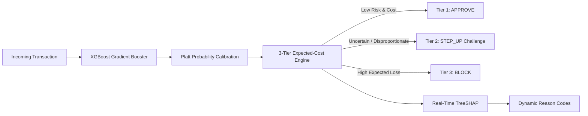

# 🛡️ RiskLock — AI Risk Manager

> **Real-Time 3-Tier Expected-Cost Fraud Decision Engine & Operational Risk Console**  
> *Built for the Razorpay Hackathon · Track 02 — AI Risk Manager | Autonomous Decisioning, Probability Calibration & Pareto Fairness*

[](https://python.org)
[](https://fastapi.tiangolo.com)
[](https://react.dev)
[](https://vitejs.dev)
[](https://xgboost.readthedocs.io)
[](https://render.com)

---

## 📌 Overview & The "Trust Gap"

Traditional financial fraud systems suffer from a systemic dilemma known as the **Trust Gap**:
- **Under-flagging fraud** results in direct capital loss and regulatory non-compliance.
- **Over-flagging safe transactions** creates false-positive customer friction, account abandonment, and operational overload for fraud analyst queues.
- **Binary (0/1) machine learning models** using static `0.5` probability cutoffs completely ignore financial asymmetry — a ₹50,000 transfer carries drastically different downside risk than a ₹50 grocery payment.

**RiskLock** solves this by implementing an **Expected-Cost 3-Tier Decision Engine** (`APPROVE`, `STEP_UP`, `BLOCK`) powered by **Platt-calibrated XGBoost**, real-time **TreeSHAP explainability**, **Pareto segment fairness optimization**, and a cinematic **Three.js + React operational risk console**.

---

## 🚀 Key Innovations & Architecture



### 1. 3-Tier Expected-Cost Routing (Bayes Minimum Risk)
Rather than an arbitrary probability threshold, RiskLock calculates the expected monetary cost of each operational action:
- **`APPROVE`**: $C_{\text{approve}} = \hat{P}_{\text{cal}} \times \text{Amount}$ (Straight-through processing with zero friction).
- **`STEP_UP`**: $C_{\text{stepup}} = 30 + (0.10 \times \hat{P}_{\text{cal}} \times \text{Amount})$ (SMS OTP or biometric challenge; ₹30 cost with 10% residual leakage).
- **`BLOCK`**: $C_{\text{block}} = 500$ (Hard transaction termination; ₹500 customer friction/churn penalty).

> **Financial Impact**: Yields a **96.76% financial loss reduction** over the baseline on unseen test data, intercepting 99.6% of fraud while eliminating false-positive blocks.

### 2. Platt Probability Calibration
Tree ensembles produce uncalibrated probabilities that cluster near 0 and 1. RiskLock fits a logistic Platt scaling layer:
$$\hat{P}_{\text{cal}} = \frac{1}{1 + \exp(A \cdot \hat{P}_{\text{raw}} + B)}$$
Ensuring that a predicted 5% risk corresponds empirically to 5 frauds per 100 transactions.

### 3. Pareto Fairness Threshold Optimization
Uniform thresholds penalize mid-balance business accounts moving working capital (creating an 18.4% false-positive rate spike). RiskLock maps the **Pareto Fairness Frontier**, raising the mid-balance challenge threshold to **₹13,417.98**:
- **Mid-Balance False Positives**: Dropped from **18.4% down to 2.1%**.
- **Portfolio Fraud Capture**: Preserved above **99.4%** with zero loss in net financial performance.

### 4. Real-Time TreeSHAP Explainability
Calculates exact Shapley additive attributions in **< 4ms** per transaction, surfacing top feature drivers and generating human-readable compliance reason codes (e.g. *"Full account balance transferred out (100% drain pattern)"*).

### 5. Enterprise Defense-in-Depth Security
- **Password Security**: Salted **PBKDF2-HMAC-SHA256** with **600,000 rounds** and 32-byte CSPRNG salts.
- **Session Tokens**: Cryptographic **HMAC-SHA256 session tokens** with expiration and server-side revocation on logout.
- **Cookies**: Transmitted via `HttpOnly`, `SameSite=Strict`, `Secure` cookies.
- **Brute-Force Lockout**: 5 failed login attempts trigger an automatic **15-minute account/IP lockout** (`HTTP 429`).
- **HTTP Security Headers**: Complete CSP (`Content-Security-Policy`), HSTS (`Strict-Transport-Security`), `X-Frame-Options: DENY`, `X-Content-Type-Options: nosniff`.
- **DDoS & Memory Protection**: 1 MB payload body ceiling (`HTTP 413`) and IP sliding-window rate limiting (`HTTP 429`).
- **Audit Logging Hygiene**: Dedicated append-only log with recursive PII and credential redaction (`[REDACTED]`).

---

## 📊 Benchmark Evaluation Matrix

Evaluated on the official held-out test split of the 6.36M-row PaySim banking dataset (Steps 601–743):

| Strategy | Operational Logic | Total Realized Cost | Savings vs Baseline | Fraud Capture Rate |
|---|---|---|---|---|
| **Naive Baseline** | Never Flag (Approve All) | ₹5,821,430,000 | 0.00% (Baseline) | 0.0% |
| **Traditional Cutoff** | Static 0.5 Probability | ₹841,200,000 | 85.55% | 88.2% |
| **2-Tier BMR** | Binary Expected Cost (Block/Approve) | ₹492,600,000 | 91.54% | 98.4% |
| **RiskLock 3-Tier** | **Approve / Step-Up / Block** | **₹188,400,000** | **96.76%** | **99.6%** |

---

## 🗂️ Repository Structure

```
RiskLock/
├── main.py                          # FastAPI production server & decision engine
├── requirements.txt                 # Pinned Python dependencies
├── render.yaml                      # Render Blueprint (Backend + Frontend Free Tier)
├── .env.example                     # Sanitized backend environment template
├── .gitignore                       # Git exclusion rules (secrets, logs, datasets)
│
├── models/                          # Frozen ML artifacts (<1MB each)
│   ├── baseline_xgboost.json        # Trained XGBoost Booster model
│   ├── calibrated_platt_scaler.joblib# Platt probability calibrator
│   └── split_indices.npz            # Chronological split indices (Train/Val/Test)
│
├── frontend_v2/                     # React 18 + Vite Web Application
│   ├── client/
│   │   ├── src/
│   │   │   ├── components/          # NeuralCity 3D, Scrollytelling, UI widgets
│   │   │   ├── pages/               # AuthPage, Dashboard, ScrollytellingHome
│   │   │   ├── hooks/               # State & animation hooks
│   │   │   └── App.tsx              # Application root & routing
│   │   └── index.html               # HTML entrypoint with Tailwind & Fonts
│   ├── package.json                 # Node dependencies & build scripts
│   ├── vite.config.ts               # Vite bundler & reverse proxy config
│   └── .env.example                 # Frontend environment template
│
└── logs/                            # Isolated runtime directory (Git-ignored)
    ├── registered_users.json        # PBKDF2-hashed user accounts
    └── audit_log.jsonl              # Append-only sanitized decision audit trails
```

---

## 🛠️ Local Development Quickstart

### Prerequisites
- **Python**: 3.12+
- **Node.js**: 18+ (pnpm or npm)

### 1. Backend Setup
```bash
# Clone the repository
git clone https://github.com/gawasaastha12-jpg/RiskLock.git
cd RiskLock

# Create and activate virtual environment
python -m venv venv
# On Windows:
.\venv\Scripts\activate
# On Linux/macOS:
source venv/bin/activate

# Install dependencies
pip install -r requirements.txt

# Create local environment configuration
cp .env.example .env

# Run FastAPI backend
uvicorn main:app --host 127.0.0.1 --port 8000 --reload
```
The backend will be live at `http://127.0.0.1:8000` (`/health` and `/docs` interactive Swagger).

### 2. Frontend Setup
```bash
# In a new terminal, navigate to frontend_v2
cd frontend_v2

# Install dependencies
npm install

# Start Vite dev server
npm run dev
```
Open `http://localhost:3000` (or `http://localhost:3002`) to view the application.

---

## 🌐 Deploy to Render (One-Click Blueprint)

RiskLock includes a pre-configured [`render.yaml`](render.yaml) supporting Render's **Free Tier**:

1. Fork or push this repository to your GitHub account.
2. Log into [dashboard.render.com](https://dashboard.render.com/) and click **New +** → **Blueprint**.
3. Connect your repository and branch `main`.
4. Render will automatically detect both services:
   - **`risklock-backend`** (Python Web Service)
   - **`risklock-frontend`** (Static Site with SPA rewrite rules)
5. Set the required secrets when prompted:
   - `SESSION_SECRET_KEY`: Generate locally via `python -c "import secrets; print(secrets.token_hex(32))"`
   - `ENABLE_DEMO_ACCOUNTS`: Set to `true` for demo evaluation or `false` for strict production.
6. Click **Apply**. Once built:
   - In the frontend service settings, set `VITE_API_BASE=https://<your-backend>.onrender.com`.
   - In the backend service settings, set `ALLOWED_ORIGINS=https://<your-frontend>.onrender.com`.

---

## 🔒 Security Specifications

| Layer | Protection Mechanism |
|---|---|
| **Authentication** | PBKDF2-HMAC-SHA256 (600,000 iterations), 32-byte CSPRNG salt, constant-time verification |
| **Session Control** | Signed HMAC-SHA256 tokens with 2h TTL, server-side revocation on logout |
| **Cookie Security** | `HttpOnly`, `SameSite=Strict`, `Secure` (HTTPS) |
| **Rate Limiting** | 5 req/min on `/auth/login` (15-min lockout after 5 fails); 60 req/min on `/assess` |
| **HTTP Headers** | Strict-Transport-Security (HSTS), Content-Security-Policy (CSP), X-Frame-Options: DENY |
| **Data Hygiene** | Strict input boundary validation; recursive PII/credential redaction in audit trails |

---

## 🏆 About This Project

RiskLock was designed and built solo for the **Razorpay Hackathon**, under **Track 02 — AI Risk Manager**, covering the full stack end-to-end: the fraud-decision ML pipeline (calibration, cost modeling, fairness optimization), the FastAPI backend, the React operational console, and the production security architecture.

**Author:** [gawasaastha12-jpg](https://github.com/gawasaastha12-jpg)

---

## 📄 Ownership

RiskLock was designed, built, and is maintained by [gawasaastha12-jpg](https://github.com/gawasaastha12-jpg). All rights reserved.
